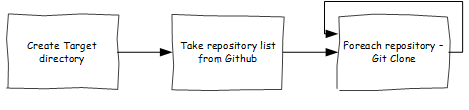
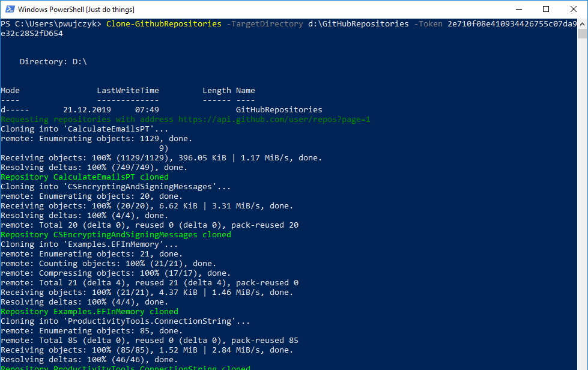

<!--Category:GAS--> 
 

    <a href="http://productivitytools.top/"><a> 
    
        

    

# Clone GitHub Repositories

Module downloads all GitHub repositories from given account to provided directory. To do it first it connects to GitHub using its API and then iterate through all returned repositories.

## Requirements
To make it work you need to:
- have Git installed in a way PowerShell will be able to use it (this is default configuration during installation of Git)
- have token generated on GitHub settings page. It can be retrieved  from https://github.com/settings/tokens

Module has two parameters:
- TargetDirectory - place where all repositories will be cloned
- Token - generated from GitHub settings page

## Usage example

